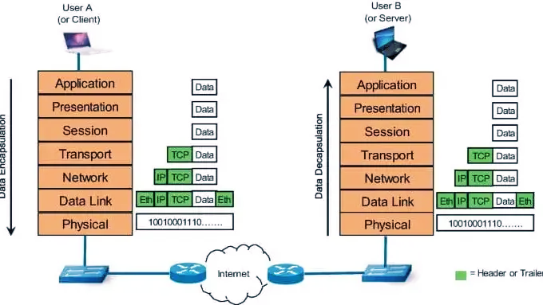

------------------------------------------------------------------------------------------------------
🎯Comprendre les bases du réseau (OSI, DHCP, NAT)
------------------------------------------------------------------------------------------------------
Cet atelier propose une exploration pratique des fondamentaux des réseaux informatiques à travers trois mécanismes essentiels : le modèle OSI, le protocole DHCP et la traduction d’adresses NAT.  
  
L’objectif est de visualiser concrètement le fonctionnement du réseau, depuis la structure des communications jusqu’à l’attribution des adresses IP et la communication avec Internet. Dans un premier temps, nous allons découvrir le modèle OSI (Open Systems Interconnection) et son rôle comme cadre conceptuel pour organiser les communications réseau en 7 couches. Ensuite, notre atelier reviendra sur le protocole DHCP, qui permet d’attribuer automatiquement une configuration réseau (adresse IP, passerelle, DNS). Et enfin, l’atelier abordera le NAT (Network Address Translation), un mécanisme clé permettant à plusieurs machines d’un réseau privé de partager une même adresse IP publique pour accéder à Internet.  
  
**Notre atelier**  
 
  

-------------------------------------------------------------------------------------------------------
🧩 Séquence 1 : GitHUB
-------------------------------------------------------------------------------------------------------
Objectif : Création d'un Repository GitHUB pour travailler avec son projet  
Difficulté : Très facile (~10 minutes)
-------------------------------------------------------------------------------------------------------
**Faites un Fork de ce projet**. Si besoin, voici une vidéo d'accompagnement pour vous aider à "Forker" un Repository Github : [Forker ce projet](https://youtu.be/p33-7XQ29zQ)  

---------------------------------------------------
🧩 Séquence 2 : Création d'un site chez Pythonanywhere
---------------------------------------------------
Objectif : Créer un hébergement sur Pythonanywhere  
Difficulté : Faible (~10 minutes)
---------------------------------------------------

Rendez-vous sur **https://www.pythonanywhere.com/** et créez vous un compte. Puis créez un serveur Web **Flask 3.13**.  
  
---------------------------------------------------------------------------------------------
🧩 Séquence 3 : Les Actions GitHUB (Industrialisation Continue)
---------------------------------------------------------------------------------------------
Objectif : Automatiser la mise à jour de votre hébergement Pythonanywhere  
Difficulté : Moyenne (~15 minutes)
---------------------------------------------------------------------------------------------
Dans le Repository GitHUB que vous venez de créer précédemment lors de la séquence 1, vous avez un fichier intitulé deploy-pythonanywhere.yml et qui est déposé dans le répertoire .github/workflows. Ce fichier a pour objectif d'automatiser le déploiement de votre code sur votre site Pythonanywhere. Pour information, c'est ce que l'on appel des Actions GitHUB. Ce sont des scripts qui s'exécutent automatiquement lors de chaque Commit dans votre projet (C'est à dire à chaque modification de votre code). Ces scripts (appelés actions) sont au format yml qui est un format structuré proche de celui d'XML.  

Pour utiliser cette Action (deploy-pythonanywhere.yml), **vous avez besoin de créer des secrets dans GitHUB** afin de ne pas divulguer des informations sensibles aux internautes de passage dans votre Repository comme vos login et password par exemple.  

Pour cet atelier, **vous avez 4 secrets à créer** dans votre Repository GitHUB : **Settings → Secrets and variables → Actions → New repository secret**  
  
**PA_USERNAME** = votre username PythonAnywhere.  
**PA_TOKEN** = votre API token. Token à créer dans pythonanywhere (Acount → API Token).  
**PA_TARGET_DIR** = Web → Source code (ex: /home/monuser/myapp).  
**PA_WEBAPP_DOMAIN** = votre site (ex: monuser.pythonanywhere.com).  
  
**Dernière étape :** Pour engager l'automatisation de votre première Action, vous devez cliquer sur le gros boutton vert dans l'onglet supérieur [Actions] dans votre Repository Github. Le boutton s'intitule "I understand my workflows, go ahead and enable them"   

Notions acquises de cette séquence :  
Vous avez vu dans cette séquence comment créer des secrets GiHUB afin de mettre en place de l'industrialisation continue.   

---------------------------------------------------
🗺️ Séquence 4 : OSI (Open Systems Interconnection)
---------------------------------------------------
Vous pouvez observez les différentes couches OSI sur votre site **{site}.pythonanywhere.com/osi**

**Exercice 1 : Définissez les termes suivants (Répondre directement dans GitHub)**    
* Un protocole = Dans le cadre du modèle OSI, il s'agit d'un ensemble de règles, de conventions et de formats, qui permettent à deux entités d'un même niveau logique de communiuer entre elle, en définissant comment une couche de donnée dialogue avec la même couche située sur une autre machine. Un protocole permet de préciser : la structure des messages échangés (comment établir une connexion), le sens des informations transportées (numéroter les segments), le comportement attendu de chaque partie, ainsi que les actions à entreprendre en cas d'erreur ou d'évènement particulier (détecter les pertes, demander un retransmission).
Le principie du protocole est d'organiser la communication de manière prévisible, compréhensible et fiable.

* Une entité protocolaire = la partie d'une couche qui met en oeuvre le protocole de cette couche dans un système donné. Dans chaque machine, chaque couche contient une logique de fonctionnement qui exécute les règles du protocole. La communication s'effectue logiquement entre entités protocolaires homologues.
Exemple : l’entité protocolaire de la couche réseau sur la machine A communique logiquement avec l’entité protocolaire de la couche réseau sur la machine B.
Précisément, une entité protocolaire est chargée de :
- Appliquer les règles du protocole,
- Construire ou interpréter les PDU,
- Ajouter ou retirer les informations de contrôle,
- Dialoguer avec les couches voisines (supérieure et inférieure) par l’intermédiaire de services.
Exemple d'application : Dans la couche liaison de données, une entité protocolaire peut : construire une trame, ajouter une adresse MAC source et destination, calculer un contrôle d’erreur, transmettre la trame à la couche physique.
Lorsque le protocole est la règle, l’entité protocolaire est le composant qui applique cette règle dans une machine.

* Un service =  Dans le modèle OSI, chaque couche a une mission précise.
Mais elle ne travaille pas seule : elle met certaines fonctionnalités à disposition de la couche au-dessus. Cet ensemble de fonctionnalités constitue le service. Un service est donc l’ensemble des fonctions offertes par une couche à la couche supérieure.
Il faut bien distinguer :
- Le protocole : il décrit comment deux entités de même couche communiquent entre elles,
- Le service : il décrit ce qu’une couche offre à la couche supérieure.
Ainsi, un service correspond à la vue utilisateur de la couche, tandis que le protocole correspond à la mécanique interne de communication.
Par exemple, la couche transport peut offrir à la couche session ou application un service de, transfert de données de bout en bout, contrôle de flux, détection ou correction d’erreurs, segmentation/réassemblage.
Idée clé
- Le service, c’est ce qu’une couche fournit.
- Le protocole, c’est comment cette couche s’organise pour le fournir.

* Une primitive de service = Une primitive de service est une commande ou une interaction formelle permettant à une couche d’utiliser les services de la couche inférieure.
Dans l’architecture OSI, les couches communiquent entre elles selon une interface bien définie.
Les primitives sont les moyens normalisés d’accès au service.
Autrement dit, une primitive est une sorte de point d’échange formel entre la couche utilisatrice et la couche fournisseuse de service.
Les primitives classiques dans l’OSI
On retrouve souvent quatre grandes formes :
- REQUEST : une couche demande un service ;
- INDICATION : une couche informe une autre qu’un événement s’est produit ;
- RESPONSE : réponse à une indication ;
- CONFIRM : confirmation qu’une demande a été traitée.
La primitive de service est donc le mécanisme concret par lequel une couche accède au service d’une autre couche.

* Une Service Data Unit (SDU) par rapport à une PDU =
- Définition de la SDU : Une SDU (Service Data Unit) est la donnée transmise par la couche supérieure à la couche inférieure au travers du service. C’est donc, du point de vue d’une couche donnée, la charge utile reçue depuis la couche supérieure.
- Définition de la PDU : Une PDU (Protocol Data Unit) est l’unité de données propre à une couche, c’est-à-dire la donnée que cette couche construit en ajoutant ses propres informations de contrôle à la SDU.

Relation entre SDU et PDU
- La SDU est ce que la couche reçoit ;
- La PDU est ce que la couche fabrique pour communiquer avec son homologue distant.

Quand une couche reçoit une SDU depuis la couche supérieure, elle ajoute généralement : un en-tête, parfois une queue/trailer, éventuellement des informations de contrôle.
Le résultat devient alors une PDU.
On peut donc résumer ainsi : PDU = SDU + informations de protocole de la couche

Exemple dans l’OSI

Supposons qu’une couche transport reçoive des données applicatives :
  Pour la couche transport, ces données sont une SDU,
  Après ajout de son en-tête de transport, elle produit une PDU de transport.
  Ensuite, cette PDU descend vers la couche réseau :
    Pour la couche réseau, la PDU de transport devient une SDU,
    La couche réseau ajoute son propre en-tête,
    Elle fabrique alors sa PDU réseau.
      Et ainsi de suite...

Une même donnée peut donc être une PDU pour une couche, puis une SDU pour la couche inférieure.
C’est exactement le principe de l’encapsulation dans le modèle OSI.

* Un point d'accès à un service SAP (Service Access Point) = c'est le point d’interface par lequel une couche supérieure accède aux services de la couche inférieure.
C’est donc un point d’entrée logique vers les services d’une couche.
Dans le modèle OSI, une couche ne dialogue pas de manière vague avec la couche inférieure : elle passe par un point d’accès précis.
Le SAP permet d’identifier où et comment ce service est accessible.
SAP permet d'identifier un accès à un service, de faire le lien entre utilisateur de service et fournisseur de service, et de distinguer plusieurs utilisateurs possibles d’un même service.
Dans la logique OSI, le SAP est donc une interface logique localisée entre deux couches adjacentes. Le SAP n’est pas le service lui-même, mais c'est l’endroit logique où ce service est accessible.

Résumé final des notions abordées :
- Protocole : règles de communication entre entités homologues ;
- Entité protocolaire : composant qui applique le protocole dans une machine ;
- Service : ce qu’une couche offre à la couche supérieure
- Primitive de service : moyen formel d’utiliser ce service ;
- SDU : donnée reçue de la couche supérieure ;
- PDU : donnée enrichie par la couche pour son propre protocole ;
- SAP : point logique d’accès au service.

---------------------------------------------------
🗺️ Séquence 5 : Retour sur le protocole DHCP
---------------------------------------------------
Vous pouvez observez le protocole DHCP sur votre site **{site}.pythonanywhere.com/dhcp**  
  
**Exercice 2 : Créer une image montrant l’encapsulation des couches suivantes**    
_Collez votre image ici_ 
  
--------------------------------------------------------------------
🧠 Troubleshooting :
---------------------------------------------------
Objectif : Visualiser ses logs et découvrir ses erreurs
---------------------------------------------------
Lors de vos développements, vous serez peut-être confronté à des erreurs systèmes car vous avez faits des erreurs de syntaxes dans votre code, faits de mauvaises déclarations de fonctions, appelez des modules inexistants, mal renseigner vos secrets, etc…  
Les causes d'erreurs sont quasi illimitées. **Vous devez donc vous tourner vers les logs de votre système pour comprendre d'où vient le problème** :  

Vos log sont accéssible via les URL suivantes :  
* Access log : {site}.pythonanywhere.com.access.log
* Error log : {site}.pythonanywhere.com.error.log
* Server log: {site}.pythonanywhere.com.server.log
